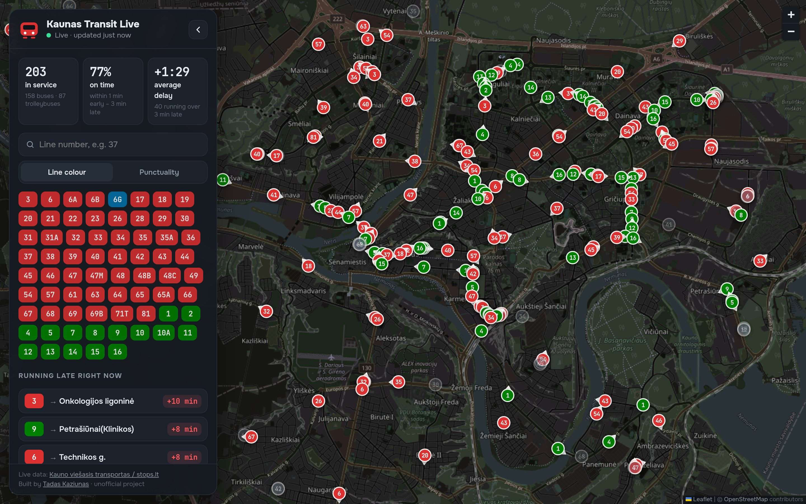
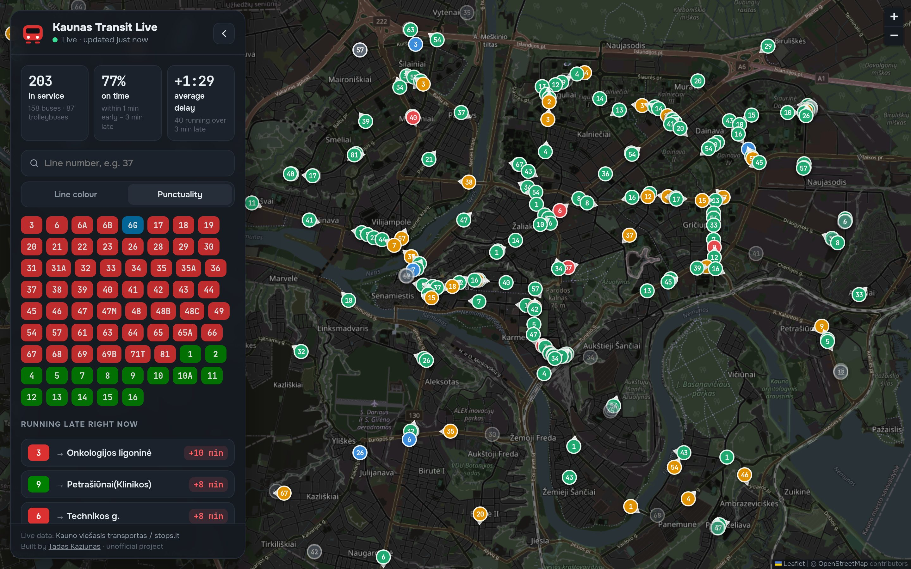
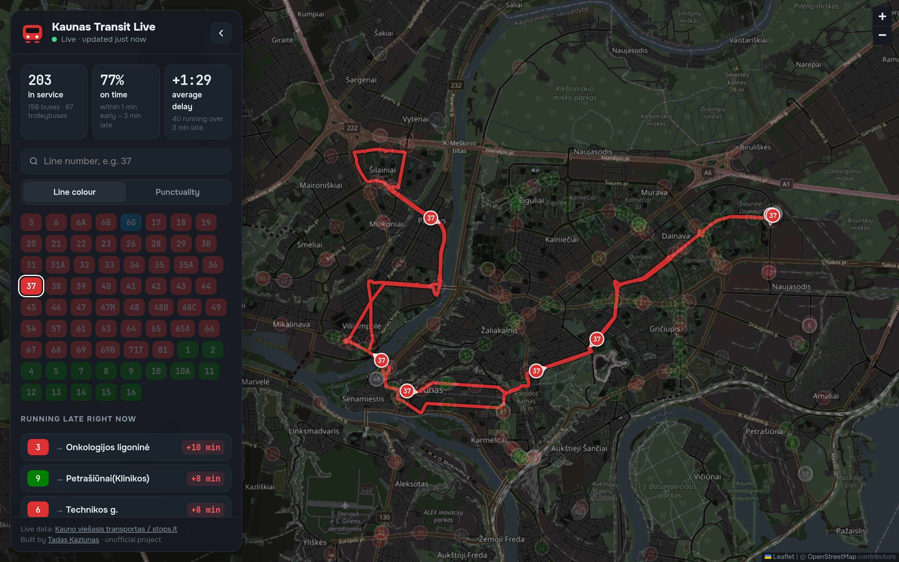
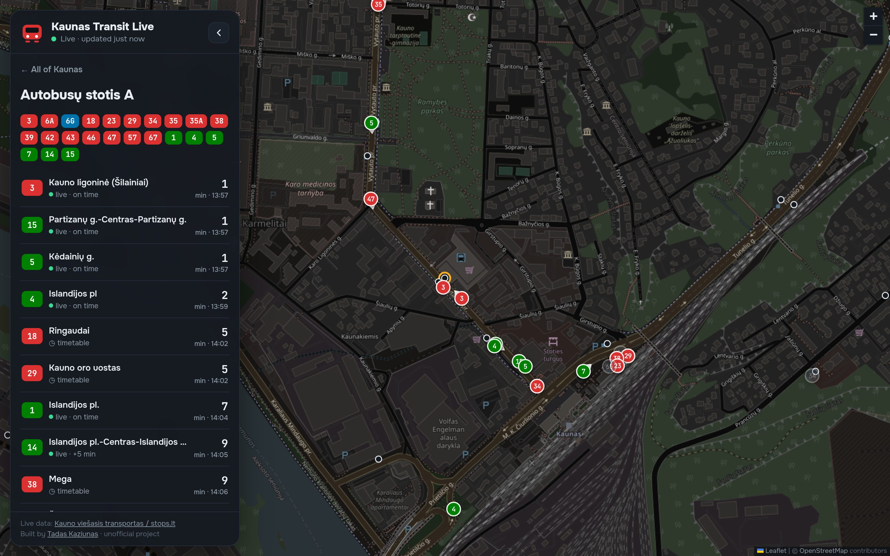
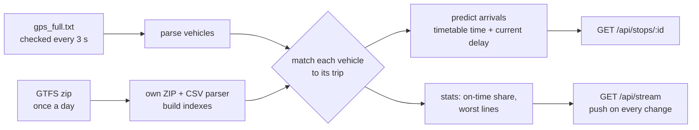

# Kaunas Transit Live

[](https://github.com/Tadas380/kaunas-transit-live/actions/workflows/test.yml)


Every bus and trolleybus in Kaunas on a live map. You can see **how late each one is**, which lines are running worst right now, and **live arrival predictions for all 966 stops**.

**Live demo:** _add your Render link here_



## What it does

- **Truly live map:** about 250 vehicles. Each new position is **pushed to the browser the moment the city publishes it** (about every 5 seconds), and in between every vehicle keeps moving along its own route at its reported speed, so the map never freezes. Each shows its line number, official line colour and direction of travel.
- **Punctuality view:** colours every vehicle by delay (on time, late, very late, early). The panel shows the share of vehicles on time, the average delay, and the lines and vehicles running latest right now.
- **Live stop arrivals:** tap any stop to see the next departures. Predictions from the vehicle's GPS are marked **live**; lines whose next bus hasn't set off yet fall back to the timetable.
- **Line and vehicle views:** pick a line to see its route and only its vehicles, or tap a vehicle to see its route, delay, speed and next stop.
- **Nearest stop:** one button finds the closest stop to you and shows its departures.
- **Shareable links** such as `/#line=37` and `/#stop=2860`. Works on phones (bottom-sheet layout).

| Punctuality | One line | Stop arrivals |
|---|---|---|
|  |  |  |

## How it works

Kaunas publishes two data sources, both through [stops.lt](https://www.stops.lt/kaunas/):

1. **The timetable** as a [GTFS](https://gtfs.org/) feed: 69 routes, 966 stops, ~7,200 trips and ~208,000 stop times.
2. **A live GPS file** (`gps_full.txt`) with each vehicle's position, speed, heading, **delay in seconds**, the trip it's running and its next stop.

The live file only tells you about each vehicle's *next* stop. To predict arrivals at *every* stop, the server links each vehicle to its exact timetable trip and projects its delay onto the stops ahead:



**Trip matching** takes the vehicle's line and trip start time and looks for timetable trips that are running today (weekday/weekend services, holiday exceptions, and trips that run past midnight). It scores them by whether the vehicle's next stop is on the trip, whether the destination matches, and how close the start times are. Some details it has to handle:

- The live feed sometimes counts a trip from its **nominal** start (the `…-1243` in the trip id) and sometimes from the actual first departure (12:45). Matching tolerates a few minutes' difference.
- At the first stop, GTFS arrival and departure differ (a trolleybus arrives 13:30 and leaves 13:44), and the feed uses the departure.
- On loop routes a stop can appear twice in one trip, so the right occurrence is picked by time.
- Vehicles waiting at the terminus still report their *finished* trip, while their ETA already points at the *next* one. These are detected and shown greyed out instead of producing wrong predictions.

**Results on a real snapshot** (Tuesday 29 Sep 2026, 13:57, 245 vehicles): **all 245 matched to a trip**. For 90% of vehicles in service, the predicted time at the next stop agrees with the operator's own estimate to within one second. The sign of the delay (positive means late) was checked against the timetable before building on it.

## Engineering notes

- **Zero dependencies.** Node's built-in `http`, `zlib` and `fetch` only. The GTFS ZIP is read by a small ZIP reader (`lib/zip.js`) and a streaming CSV parser (`lib/csv.js`). The full feed loads in ~1.2 s using ~95 MB of memory.
- **Push, not polling.** Browsers keep one [Server-Sent Events](https://developer.mozilla.org/en-US/docs/Web/API/Server-sent_events) connection open. The server checks the city feed every 3 seconds and pushes a new snapshot only when it has actually changed, gzip-compressed (~60 KB of JSON becomes a few KB). If a network blocks event streams, the page falls back to polling on its own.
- **Kind to the data source.** One upstream check serves every viewer, polling stops completely when nobody is watching, and concurrent requests share one upstream call. If the feed hiccups, the last good data is served.
- **Smooth motion between updates.** Each vehicle is placed on its trip's route line and moved forward along it at its reported speed (at most 10 s ahead). When the next real position arrives, the marker glides onto it over 1.5 s instead of jumping. Loop routes are handled by preferring the part of the line that points the way the vehicle is heading.
- **Small payloads.** Route shapes are simplified with Douglas–Peucker (≈40k points instead of ≈89k), and the whole network is sent gzipped once (~115 KB).
- **Timezone-safe.** All schedule maths runs in `Europe/Vilnius` whatever timezone the server is in, including trips past midnight (`24:35:00`).
- **Security.** Strict Content-Security-Policy (no inline scripts, no CDN; Leaflet is self-hosted), HSTS, frame and MIME protection, path-traversal-safe static files, and all dynamic text inserted with `textContent`.
- **Map.** OpenStreetMap tiles darkened with a CSS filter, so no API keys are needed.

## Project structure

```
server.js            HTTP server, caching, API routes, timetable refresh
lib/zip.js           ZIP reader (central directory + zlib inflate)
lib/csv.js           CSV parser (quotes, BOM, CRLF), row by row
lib/time.js          Europe/Vilnius local time, service days
lib/gtfs.js          GTFS loader: routes, stops, trips, calendar, shapes, indexes
lib/live.js          live feed parser, trip matching, arrival predictions, stats
public/              map UI (vanilla JS + Leaflet 1.9.4, self-hosted)
tests/               node:test suite + a real two-line sample (bus 3, trolleybus 2)
```

## Run it

```bash
git clone https://github.com/Tadas380/kaunas-transit-live.git
cd kaunas-transit-live
npm start            # live data, http://localhost:3000, no npm install needed
npm run dev          # offline demo on the bundled sample (no live data needed)
npm test             # 17 tests
```

**Deploy:** any Node host. On Render (free tier), create a Web Service with start command `node server.js`. No environment variables are needed.

## API

| Path | Returns |
|---|---|
| `GET /api/network` | routes (with colours), stops (with the lines serving them), simplified route shapes |
| `GET /api/stream` | Server-Sent Events: a `live` event with the same data as `/api/live` every time the feed changes, and a `ping` every 10 s |
| `GET /api/live` | every vehicle (position, speed, heading, delay, next stop, matched trip shape) and network stats |
| `GET /api/stops/:id` | the next ~12 arrivals at a stop, live or timetable |
| `GET /api/health` | timetable load time and age of live data |

## Limitations

- The city's feed updates about every 5 seconds, so that's the true resolution of the data. Movement in between is an estimate from speed and route.
- Predictions assume a vehicle keeps its current delay for the rest of the trip. There's no traffic model.
- Trips that should have started but have no GPS vehicle aren't shown, rather than showing a possibly cancelled bus.
- OpenStreetMap's public tile servers are for light use. A high-traffic deployment should use its own tile provider.

## Data and credits

Timetable and live positions: **Kauno viešasis transportas**, published on [stops.lt](https://www.stops.lt/kaunas/). Map data © [OpenStreetMap](https://www.openstreetmap.org/copyright) contributors. Map library: [Leaflet](https://leafletjs.com/) (BSD-2).
This is an unofficial hobby project and isn't affiliated with the city of Kaunas or the operator.

---

Built by **Tadas Kaziunas**, Kaunas · [github.com/Tadas380](https://github.com/Tadas380) · MIT license
